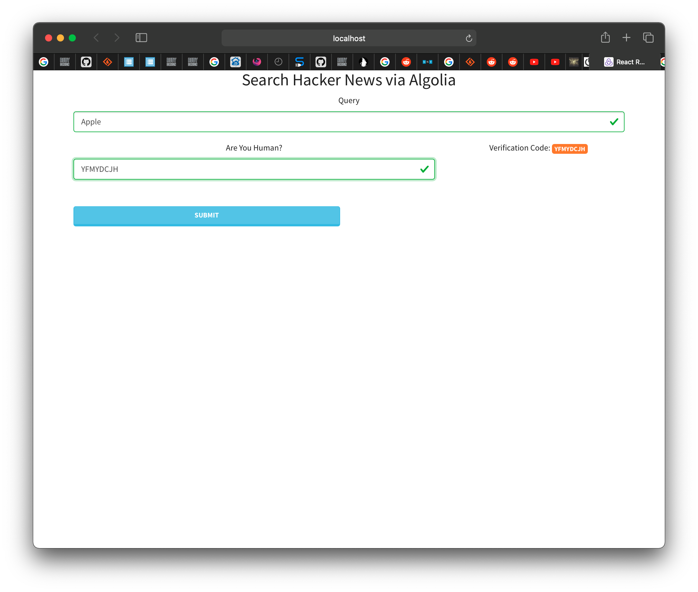

# HN-Algolia
At-home exercise for RTS-Labs to demonstrate the ability to pick up an unfamiliar element and integrate it into a project.

## About this project
I was unable to finish due to CORS issues that I spent the entire day trying to get around without building an express server to proxy the requests, maybe I was supposed to.... I can say for certain, that I know how to deal with CORS when I have access to both the Front End and the Server. I have written and used plenty of REST API's.
My next steps would have been to build a posts component to display each entry in a meaningful way, and then map the data onto the post component x times.
After that I was going to include a tag cloud of the previous searches, clicking one would repeat the search.

### Front End
React - My goto.

I tried Axios, Fetch, and window.fetch to attempt to get around CORS, modifying the header and such, to no avail.

Formik and Yup - Form handling and validation, with descriptive warning messages.

Reactstrap - Bootstrap wrapped in React components, I used the "Lumen" theme from Bootswatch this time.

**Redux!** - Ever since I discovered context API, I haven't touched Redux, and so much has changed. Much less boilerplate code than before, easier to follow reading through it.

#### Noteworthy
I usually use the package "Express Brute" to prevent abuse of the services I create, but since this is Front End only, I created a simple captcha type hack to deal with that possibility.

### Screenshot

This project is hosted on my private server [HERE CLICK ME!](https://hna.danielmattox.com)

